# MultiAgentSample — マルチエージェント設計レビューシステム

## 概要

GitHub Copilot のカスタムエージェントモード（`.agent.md`）とサブエージェントを組み合わせ、**詳細設計書のレビューを自動化**するサンプルプロジェクトです。

司令塔エージェント（レビューリーダー）が2つのサブエージェント（基本設計よみとり係 / 規約チェッカー）に調査を委任し、その結果を統合して詳細設計書をクロスチェックします。

本プロジェクトは、**チャット → 単一エージェント → マルチエージェント** という AI アシスタントの進化を踏まえた **Agent RAG（エージェントによる検索・要約・統合）パターン** の検証を兼ねています。

---

## AIアシスタントの進化と本プロジェクトの位置づけ

### 3段階の進化

```
Stage 1: チャット（Chat）
  ユーザー ⇄ LLM
  「質問に答える」「コードを提案する」

Stage 2: 単一エージェント（Single Agent）
  ユーザー → エージェント → ツール群（ファイル読み書き、ターミナル実行、検索…）
  「自律的に調べて、考えて、実行する」

Stage 3: マルチエージェント（Multi-Agent）  ← 本プロジェクト
  ユーザー → 司令塔エージェント → サブエージェント群（各自がツールを持つ）
  「分業し、要約し、統合する」
```

| 段階 | できるようになったこと | まだできなかったこと |
|---|---|---|
| **チャット** | 質問応答、コード生成、説明 | ファイル操作やコマンド実行（人間が代行） |
| **単一エージェント** | ファイル読み書き、コマンド実行、複数ステップの自律的な問題解決 | 大量の文書を扱うとコンテキストが溢れる。1体で全責務を担うため精度が分散 |
| **マルチエージェント** | コンテキストの分離と圧縮、専門特化による精度向上、並列実行 | ← **本プロジェクトで検証** |

### Agent RAG — マルチエージェントで実現するインテリジェントな情報取得

従来のRAGはベクトルDBからのチャンク検索が中心ですが、**Agent RAG** はエージェント自身が「何を取得すべきか」を判断し、取得した情報を要約・構造化してから次の処理に渡します。

```
【従来の RAG】
  ユーザー質問 → ベクトル検索 → 上位kチャンク → LLM → 回答
                  （機械的な類似度検索）

【Agent RAG（本プロジェクトの構成）】
  ユーザー指示 → 司令塔が委任先を判断
                   ├→ エージェントAが文書を精読 → 要件を構造化して報告
                   └→ エージェントBが文書を精読 → 規約を構造化して報告
                 司令塔が統合・推論 → レビュー結果
                  （エージェントが検索・要約・統合を自律的に実行）
```

---

## エージェント構成

| エージェント | Agent RAG での役割 | 入力 | 出力 |
|---|---|---|---|
| **レビューリーダー**（司令塔） | 推論・統合レイヤー | 詳細設計書 + サブエージェントの報告 | レビュー結果（指摘一覧） |
| **基本設計よみとり係** | 検索・要約レイヤー① | `login_bd.md` | 構造化された要件レポート |
| **規約チェッカー** | 検索・要約レイヤー② | `ui_rules.md` | 構造化された規約レポート |
| **修正担当** | アクションレイヤー | 指摘リスト + `login_dd.md` | 修正版ファイル `login_dd_v2.md` |
| **テクニカルライター** | 知見の言語化 | 対話履歴・プロンプト構成 | 技術ブログ向けマークダウン記事 |

---

## シーケンス図①：レビューフロー（情報収集→突合→指摘）

```mermaid
sequenceDiagram
    actor User as ユーザー
    participant DR as Design Reviewer<br/>(司令塔エージェント)
    participant BDR as BasicDesignReader<br/>(サブエージェント)
    participant RC as RuleChecker<br/>(サブエージェント)
    participant FS as ファイルシステム

    rect rgb(40, 40, 60)
        Note over DR: 【司令塔のコンテキストウィンドウ】<br/>━━━━━━━━━━━━━━━━━━<br/>・システムプロンプト（モード指示）<br/>・ユーザーの会話履歴<br/>・ツール呼び出し結果すべて<br/>・サブエージェントの返答すべて<br/>━━━━━━━━━━━━━━━━━━<br/>⚠ 会話が続く限り蓄積され続ける<br/>⚠ サブエージェントの返答も含め<br/>　 全情報がここに集約される
    end

    User->>DR: 「docs/detail_design/login_dd.md をレビューして」

    par 並列実行
        DR->>FS: read_file(login_dd.md)
        FS-->>DR: 詳細設計書の全文 → 司令塔のコンテキストに追加

        DR->>BDR: runSubagent(prompt)

        rect rgb(60, 40, 40)
            Note over BDR: 【BDRのコンテキストウィンドウ】<br/>━━━━━━━━━━━━━━━━━━<br/>・司令塔から渡されたpromptのみ<br/>・ユーザーの会話履歴は見えない<br/>・司令塔が読んだ login_dd.md も見えない<br/>・RuleCheckerの結果も見えない<br/>━━━━━━━━━━━━━━━━━━<br/>✅ 独立した軽量コンテキストで<br/>　 login_bd.md の分析に専念
        end

        BDR->>FS: read_file(login_bd.md)
        FS-->>BDR: 基本設計書の全文 → BDRのコンテキストに追加

        Note over BDR: BDRが基本設計を要約・構造化<br/>📉 原文の情報量を圧縮して返答

        BDR-->>DR: 構造化レポート（要約済み）<br/>→ 司令塔のコンテキストに追加<br/>📌 BDRのコンテキストはここで破棄
    end

    DR->>RC: runSubagent(prompt)

    rect rgb(40, 60, 40)
        Note over RC: 【RCのコンテキストウィンドウ】<br/>━━━━━━━━━━━━━━━━━━<br/>・司令塔から渡されたpromptのみ<br/>・ユーザーの会話履歴は見えない<br/>・BDRの結果も見えない<br/>・司令塔が読んだ login_dd.md も見えない<br/>━━━━━━━━━━━━━━━━━━<br/>✅ 独立した軽量コンテキストで<br/>　 ui_rules.md の分析に専念
    end

    RC->>FS: read_file(ui_rules.md)
    FS-->>RC: UI規約書の全文 → RCのコンテキストに追加

    Note over RC: RCがUI規約を要約・構造化<br/>📉 原文の情報量を圧縮して返答

    RC-->>DR: 構造化レポート（要約済み）<br/>→ 司令塔のコンテキストに追加<br/>📌 RCのコンテキストはここで破棄

    rect rgb(40, 40, 60)
        Note over DR: 【この時点の司令塔コンテキスト内容】<br/>━━━━━━━━━━━━━━━━━━━━<br/>1. システムプロンプト + モード指示<br/>2. ユーザー発話「レビューして」<br/>3. login_dd.md の全文（read_file結果）<br/>4. BDRの要約レポート（基本設計）<br/>5. RCの要約レポート（UI規約）<br/>━━━━━━━━━━━━━━━━━━━━<br/>💡 login_bd.md, ui_rules.md の原文自体は<br/>　 司令塔のコンテキストには入っていない<br/>　 → サブエージェントが要約した結果のみ
    end

    Note over DR: 3情報源をクロスチェック<br/>→ 7件の指摘を生成

    DR-->>User: レビュー結果報告（7件の指摘）<br/>→ この応答も司令塔コンテキストに蓄積
```



---

## シーケンス図②：修正フロー（修正担当サブエージェント）

レビュー結果の報告後、ユーザーから「修正して」と指示があった場合の処理フローです。

```mermaid
sequenceDiagram
    actor User as ユーザー
    participant DR as Design Reviewer<br/>(司令塔エージェント)
    participant IMP as Implementer<br/>(サブエージェント)
    participant FS as ファイルシステム

    rect rgb(40, 40, 60)
        Note over DR: 【この時点の司令塔コンテキスト】<br/>━━━━━━━━━━━━━━━━━━<br/>① システムプロンプト + モード指示<br/>② ユーザー発話「レビューして」<br/>③ login_dd.md の全文<br/>④ BDRの要約レポート（基本設計）<br/>⑤ RCの要約レポート（UI規約）<br/>⑥ 司令塔が生成したレビュー結果（7件）<br/>⑦ ユーザー発話「修正して」<br/>━━━━━━━━━━━━━━━━━━<br/>💡 レビューフェーズの全履歴が<br/>　 蓄積された状態で修正に入る
    end

    User->>DR: 「先ほどの指摘事項をもとに<br/>修正版を作成して。別名で作成して」

    Note over DR: 司令塔が自身のコンテキストから<br/>7件の指摘事項を整理し<br/>修正指示プロンプトを構築

    DR->>IMP: runSubagent(prompt)

    rect rgb(60, 50, 30)
        Note over IMP: 【Implementerのコンテキストウィンドウ】<br/>━━━━━━━━━━━━━━━━━━━━<br/>・司令塔から渡されたpromptのみ<br/>━━━━━━━━━━━━━━━━━━━━<br/>promptに含まれる情報:<br/>　✅ 修正対象ファイルパス (login_dd.md)<br/>　✅ 出力先ファイルパス (login_dd_v2.md)<br/>　✅ 全7件の指摘事項リスト<br/>　　 A-1: ロック回数 5回→3回連続<br/>　　 A-2: こおり状態（ロック）名称<br/>　　 A-3: ジョーイさん連絡案内<br/>　　 B-1: 画面ID命名規則<br/>　　 B-2: マスク文字 *→🔴<br/>　　 B-3: エラー文バトル構文化<br/>　　 B-4: ロック文バトル構文化<br/>　✅ 修正ルール（構造維持、変更コメント付与）<br/>━━━━━━━━━━━━━━━━━━━━<br/>❌ ユーザーの会話履歴は見えない<br/>❌ BDR/RCのレポート原文は見えない<br/>❌ 基本設計書・UI規約の原文は見えない<br/>━━━━━━━━━━━━━━━━━━━━<br/>⚠ 司令塔が指摘を「十分な粒度で」<br/>　 promptに書き下すことが品質の鍵
    end

    IMP->>FS: read_file(login_dd.md)
    FS-->>IMP: 修正対象の原文 → IMPのコンテキストに追加

    Note over IMP: 原文 + 7件の指摘リストを照合<br/>各指摘箇所を特定し修正を適用

    Note over IMP: 修正内容:<br/>━━━━━━━━━━━━━━━<br/>A-1: 5回 → 「3回連続」<br/>A-2: ロック → 「こおり状態（ロック）」<br/>A-3: ジョーイさん連絡メッセージ追加<br/>B-1: LOGIN-MAIN-01 → SCR-006-FIRE<br/>B-2: * → 🔴<br/>B-3: バトル構文エラー文に置換<br/>B-4: バトル構文ロック文に置換<br/>━━━━━━━━━━━━━━━<br/>各修正箇所に「← 修正」コメント付与

    IMP->>FS: create_file(login_dd_v2.md)
    FS-->>IMP: ファイル作成成功

    IMP-->>DR: 修正完了レポート<br/>（修正7件の対応表）<br/>→ 司令塔のコンテキストに追加<br/>📌 IMPのコンテキストはここで破棄

    rect rgb(40, 40, 60)
        Note over DR: 【修正後の司令塔コンテキスト】<br/>━━━━━━━━━━━━━━━━━━<br/>①〜⑦（レビューフェーズの全履歴）<br/>＋⑧ Implementerへの修正指示prompt<br/>＋⑨ Implementerの修正完了レポート<br/>━━━━━━━━━━━━━━━━━━<br/>💡 login_dd_v2.md の全文自体は<br/>　 Implementerが直接FSに書き込んだため<br/>　 司令塔のコンテキストには載らない<br/>　 → 必要なら read_file で確認する
    end

    DR->>FS: read_file(login_dd_v2.md)
    FS-->>DR: 修正版の全文 → 内容を確認

    DR-->>User: 修正完了報告 + 修正サマリー表
```



### レビュー → 修正 の2フェーズにおけるコンテキストの流れ

```
フェーズ1（レビュー）                     フェーズ2（修正）
┌─────────────────────┐                ┌─────────────────────┐
│  BDR コンテキスト     │                │  IMP コンテキスト     │
│  ┌─────────────────┐ │                │  ┌─────────────────┐ │
│  │ prompt          │ │                │  │ prompt          │ │
│  │ login_bd.md原文  │ │                │  │ (7件の指摘リスト) │ │
│  │ → 要約して返答   │ │                │  │ login_dd.md原文  │ │
│  └────────┬────────┘ │                │  │ → 修正版を作成   │ │
│           │ 破棄     │                │  └────────┬────────┘ │
└───────────┼─────────┘                │           │ 破棄     │
            │                          └───────────┼─────────┘
            ▼                                      ▼
┌─────────────────────────────────────────────────────────────┐
│              司令塔コンテキスト（永続・蓄積型）                │
│  ┌───────┐ ┌──────┐ ┌──────┐ ┌──────┐ ┌───────┐ ┌────────┐ │
│  │prompt │ │dd.md │ │BDR   │ │RC    │ │レビュー│ │IMP     │ │
│  │+モード│ │原文  │ │要約  │ │要約  │ │結果   │ │完了報告│ │
│  └───────┘ └──────┘ └──────┘ └──────┘ └───────┘ └────────┘ │
│                                                             │
│  💡 司令塔は全フェーズの結果を保持（ただし原文は要約のみ）    │
└─────────────────────────────────────────────────────────────┘
```

---

## コンテキストウィンドウの設計

### 1. コンテキストの分離（最重要ポイント）

各サブエージェントは **独立した使い捨てのコンテキストウィンドウ** で動作します。

| | 司令塔 (レビューリーダー) | 基本設計よみとり係 | 規約チェッカー |
|---|---|---|---|
| **ライフサイクル** | 会話全体で永続 | 1回の呼び出しで生成→破棄 | 同左 |
| **見える情報** | 全ツール結果 + 全サブエージェント返答 | 司令塔から渡された prompt のみ | 同左 |
| **ユーザー会話履歴** | ✅ 見える | ❌ 見えない | ❌ 見えない |
| **他サブエージェントの結果** | ✅ 集約される | ❌ 見えない | ❌ 見えない |

### 2. なぜサブエージェントを使うのか — コンテキスト効率とAgent RAG

#### 単一エージェントの限界

単一エージェントがすべてのファイルを直接 `read_file` した場合、**全原文がコンテキストウィンドウを消費**します。さらに、ノイズとなる無関係ファイルにも引きずられるリスクがあります。

#### マルチエージェント（Agent RAG）による解決

サブエージェントに委任すると、各エージェントが **原文を読み→要約・構造化して返す** ことで、司令塔のコンテキストには圧縮された情報だけが入ります。

```
❌ 単一エージェント（直接読み込み）:
   login_dd.md 原文 + login_bd.md 原文 + ui_rules.md 原文 + dummy_.md（ノイズ混入リスク）
   → 全量が1つのコンテキストを圧迫

✅ マルチエージェント（Agent RAG）:
   login_dd.md 原文 + BDR要約レポート + RC要約レポート
   → 原文2つ分のトークンを節約。ノイズは構造的に排除
```

ドキュメントが大規模になるほど、この差が効いてきます。

### 3. 各段階のコンテキスト管理の違い

```
【Stage 1: チャット】
┌─────────────────────────────┐
│  ユーザーが手動で貼り付けた  │
│  テキストだけが全て          │
│  → コンテキスト管理は人間   │
└─────────────────────────────┘

【Stage 2: 単一エージェント】
┌─────────────────────────────────────────────┐
│  エージェントのコンテキスト（永続・肥大化）    │
│  login_dd.md + login_bd.md + ui_rules.md     │
│  + dummy_.md（ノイズ混入リスク）              │
│  + ツール呼び出し履歴すべて                   │
│  → 全情報が1つのウィンドウに蓄積             │
└─────────────────────────────────────────────┘

【Stage 3: マルチエージェント（Agent RAG）】  ← 本プロジェクト
┌──────────────────┐  ┌──────────────────┐
│  BDR コンテキスト  │  │  RC コンテキスト   │
│  login_bd.md 読込 │  │  ui_rules.md 読込 │
│  → 要約して返答   │  │  → 要約して返答   │
│  → 破棄 ♻️        │  │  → 破棄 ♻️        │
└────────┬─────────┘  └────────┬─────────┘
         │ 要約結果              │ 要約結果
         ▼                      ▼
┌──────────────────────────────────────────────┐
│  司令塔コンテキスト（永続だが効率的）           │
│  login_dd.md + 要約×2 のみ                    │
│  → 原文は載らず、構造化情報だけが集約         │
└──────────────────────────────────────────────┘
```

### 4. トレードオフ

| 利点 | 代償 |
|---|---|
| 司令塔のコンテキスト消費を抑えられる | サブエージェント自体もLLM呼び出しなのでAPIコスト（トークン消費）は増える |
| 各サブエージェントが専門タスクに集中できる | 要約時に情報が欠落するリスクがある |
| 並列実行で応答速度向上 | 司令塔→サブエージェントへの prompt 設計が品質を左右する |
| ノイズ文書を構造的に排除できる | エージェントの責務設計にコストがかかる |

### 5. コンテキストのライフサイクル

図中の `📌 コンテキストはここで破棄` が示す通り、BDR・RC のコンテキストは返答と同時に消滅します。司令塔は **サブエージェントの最終返答テキストしか受け取れない**（途中のツール呼び出し履歴などは見えない）ため、prompt で「何を・どの粒度で報告せよ」と明確に指示することが重要です。

---

## 進化の各段階が解決した課題

| 課題 | チャットで解決？ | 単一エージェントで解決？ | マルチエージェントで解決？ |
|---|---|---|---|
| 複数ファイルの自動読み込み | ❌ 人間が貼り付け | ✅ ツールで読み込み | ✅ |
| コンテキスト溢れの防止 | — | ❌ 全原文が蓄積 | ✅ 要約ゲートで圧縮 |
| ノイズ文書の排除 | — | △ 指示次第 | ✅ 責務定義がフィルター |
| 観点別の専門的分析 | ❌ | △ 1体で全観点 | ✅ 各エージェントが特化 |
| 分析と修正の権限分離 | — | ❌ 全権限が1体に | ✅ tools で権限分離 |
| 作業の並列化 | ❌ | ❌ 逐次実行 | ✅ サブエージェント並列 |

---

## ドキュメント構成

```
docs/
├── basic_design/
│   └── login_bd.md        # 基本設計書（ログイン機能）
├── detail_design/
│   ├── login_dd.md        # 詳細設計書（レビュー対象・修正前）
│   └── login_dd_v2.md     # 詳細設計書（修正版・全7件反映済み）
├── standards/
│   └── ui_rules.md         # UI/UX設計標準規約
└── other_systems/
    └── dummy_.md            # ノイズ耐性テスト用ダミー文書
```